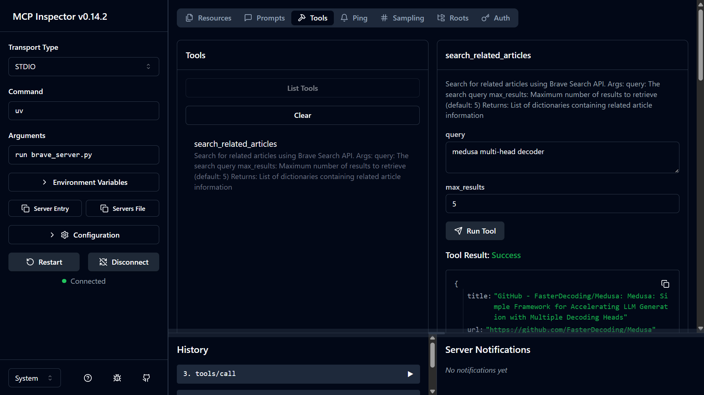

# Basic MCP Server-Client Implementation

A simple python-based implementation of a Model Context Protocol (arxiv server implementation from deeplearningai's resources).Server and client system that integrates with arXiv and Brave Search for research paper retrieval and processing. Late to the race but always wanted to implelment this :)

## Features

- MCP server implementation with multiple service endpoints
- Integration with arXiv API for research paper retrieval
- Brave Search integration for web search capabilities
- Filesystem operations(read/write) support
- Client implementation for interacting with the MCP server

Did this entire project using UV package

## Installation

1. Clone the repository:
```bash
git clone <repository-url>
cd Basic_MCP_server_client
```
2.Did this entire project using UV package, so after cloning run
```bash
uv init
uv venv
```

3. Activate the virtual environment:
```bash
# On Windows:
.venv\Scripts\activate

# On Unix/MacOS:
source .venv/bin/activate
```

4. Install dependencies:
```bash
uv add mcp request brave-search-python-client arxiv nest-asyncio psutil
```

## Usage

1. Run the arxiv server/ brave server without client using mcp inspector to check if tools, resources and prompts are running perfectly (local):
```bash
#arxiv server
npx @modelcontextprotocol/inspector uv run server.py
```

```bash
#brave server
npx @modelcontextprotocol/inspector uv run brave_server.py
```
2. Open the url to access the mcp inspector




3. Once your servers are running fine, you will need  clients to connect to these servers(It's important to note that client-server connection can be one-one and also many-many) inorder for you to give context to the llm. Here we have two chatbots(host) that uses claude sonnet to have a conversational interface.
    - mcp_chatbot.py    :  connects only with arxiv server and uses arxiv's tool,resources and prompts
    - mcp_chatbot_v2.py :  connects with arxiv,brave server and has filesystem operations

2. Run the client:
```bash
uv run mcp_chatbot_v2.py  #or 'uv run mcp_chatbot.py' to connect to only arxiv server
```

## Project Structure

- `arxiv_server_v2.py`: server that uses arxive client and exposes tools,resources and prompts
- `client.py`: Client template(just for reference)
- `mcp_chatbot.py` & `mcp_chatbot_v2.py`: Chatbot implementations
- `brave_server.py`: Brave MCP server
- `server_config.json`: Configuration file that defines multiple MCP servers (arxiv, brave, filesystem) and their connection settings, allowing mcp_chatbot_v2.py to connect to all configured servers simultaneously
- `papers/`: Directory for storing research papers from LLM response
- `assets/`: Output Images


## Outputs
1. Running mcp_chatbot.py - searches related papers,gets info and stores the paper details


2. Running mcp_chatbot_v2.py - uses the tools from arxiv server , searches the internet for relevant articles/blogs to the chosen paper and can access files locally.


3. Blogs/Article being printed out 


4. Writting the summarized blog using file operation tools


lol I tried generating a readme file for this project by giving the entire codebase as context and it wasn't successful because it exceeded input token limit(Free tier Anthropic api key). BUT it is possible to pull this off if you have a higher tier Anthropic api key or use large context size models like llama4:scout.


## Documentations/References.
You might want to refer to these documentation URLs before starting . Did this project in windows and note that installation process of certain packages are different in Linux/macOS

 - [brave api docs](https://api-dashboard.search.brave.com/app/documentation/web-search/get-started)
 - [brave package installation through UV](https://brave-search-python-client.readthedocs.io/en/latest/)
 - [https://modelcontextprotocol.io/docs/tools/inspector](https://modelcontextprotocol.io/docs/tools/inspector)
 - [https://github.com/modelcontextprotocol/inspector](https://github.com/modelcontextprotocol/inspector)
 - [https://www.npmjs.com/package/@modelcontextprotocol/server-filesystem](https://www.npmjs.com/package/@modelcontextprotocol/server-filesystem)
